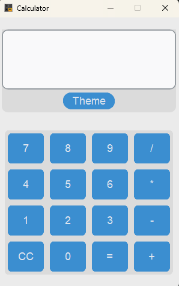
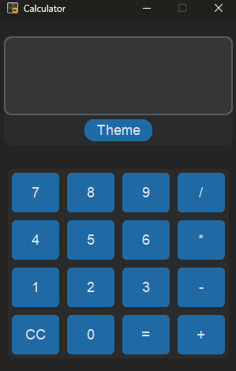

# **CustomTkinter Calculator**  

A simple yet functional calculator application built using **Python** and **CustomTkinter**. This calculator provides a user-friendly interface with basic arithmetic operations and a light/dark mode toggle for better usability.  

## **Features**  
- **Basic Arithmetic Operations**: Supports addition, subtraction, multiplication, and division.  
- **User-friendly GUI**: Built using CustomTkinter for a modern look.  
- **Light/Dark Mode**: Switch between themes with a single button click.  
- **Error Handling**: Displays an error message for invalid inputs.

## **Application Preview**


<div align="center">
  
</div>

<h4 align="center">Light Theme</h4>

<div align="center">
  
</div>

<h4 align="center">Dark Theme</h4>


## **Installation**  

1. **Clone the Repository**  
   ```bash
   git clone https://github.com/your-username/customtkinter-calculator.git
   cd customtkinter-calculator
   ```
2. **Install Dependencies**  
   ```bash
   pip install customtkinter
   ```
3. **Run the Application**  
   ```bash
   python main.py
   ```

## **Usage**  
- Click on the buttons to input numbers and operators.  
- Press `=` to evaluate the expression.  
- Press `CC` to clear the input.  
- Click the **"Theme"** button to toggle between light and dark modes.  

## **Preview**  
(Include a screenshot of your calculator UI here)

## **Technologies Used**  
- **Python**  
- **CustomTkinter**  
